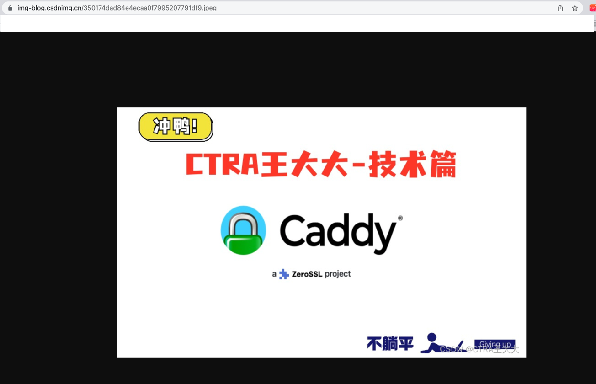

# go-remote2Base64
go读取远程（公有读）权限图片（腾讯云cos|阿里云oss|aws s3|等）生成base64字符串 <br/>
前端可以通过 img 标签直接渲染

# Installation
```go
go get -u github.com/Holyson/go-remote2Base64
```

# Mehtods
> GetRemoteConvertBase64() <br/>
> Base64StrHandler2Base64()

# Documentation
> GetRemoteConvertBase64() <br/>
> this func accpet the remote imgUrl,and used the lib "github.com/polds/imgbase64" handle the image

> params：

	1、imgUrl：public imgUrl  (on the web wo can open it) without credentials.
	2、tff：if you handle the img,you can upload yourself tff.
	3、imgName：the local img,if you get the remote and create the local img file.
	4、isDelImg：if isDelImg is true,del the create image,else don`t del.
	5、PointInfo：support to drawing the charaters on the image
> return :<br/>
> a base64 image string and error

> **used the two libs:** <br/>
> - github.com/fogleman/gg <br/>
> - github.com/polds/imgbase64  

# Quick start!
```go
func TestGetRemoteConvertBase64(t *testing.T) {
	imgUrl := "https://img-blog.csdnimg.cn/350174dad84e4ecaa0f7995207791df9.jpeg"
	tff := "longshuhongheicuti.ttf"
	imgName := "test.jpg"
	isDelImg := true
	str, err := GetRemoteConvertBase64(imgUrl, tff, imgName, isDelImg, nil)
	if err != nil {
		fmt.Println(err.Error())
	}
	fmt.Println(str)
}
```
 
# Test
> base642Image  web：https://www.toolnb.com/tools/base64ToImages.html

before convert image url: https://img-blog.csdnimg.cn/350174dad84e4ecaa0f7995207791df9.jpeg



> input the return base64Img string,we can get the image


